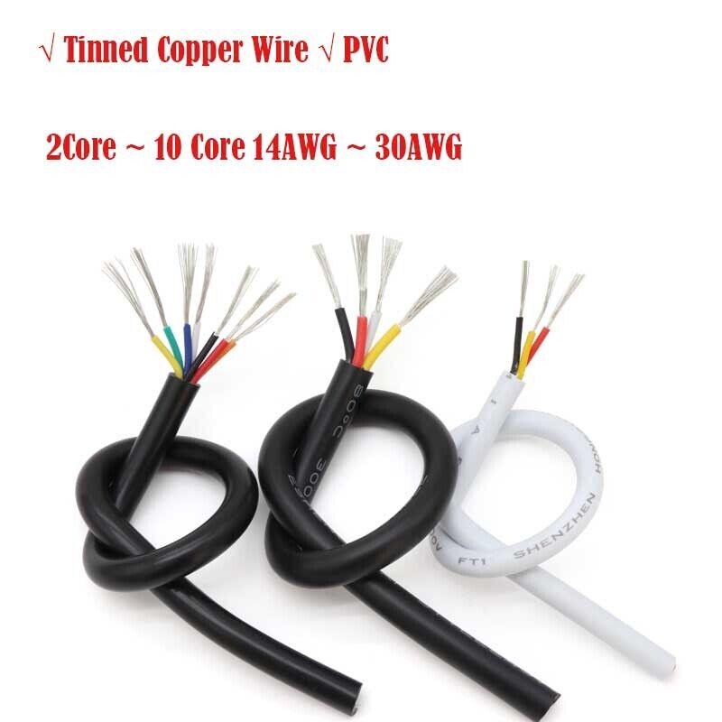
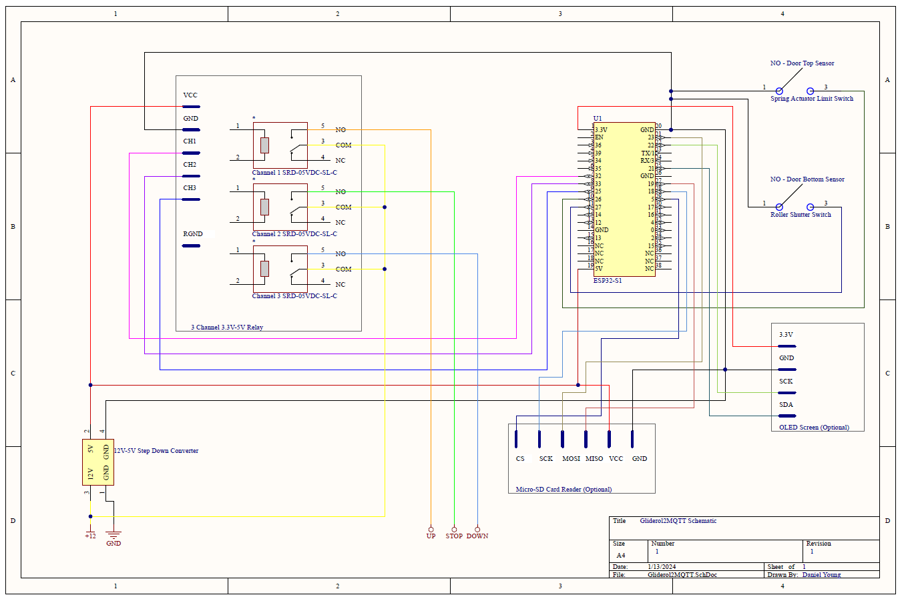

# Gliderol2MQTT (G2M)
## A smart home interface for Gliderol Electric Garage Doors driven by Glidermatic controllers.
Gliderol / Glidermatic are trademarks of Gliderol Roller Doors Pty. Ltd.

https://www.gliderol.co.uk/

https://www.gliderol.com.au/


### Supported devices are:
```
GLIDEMATIC GRD,
GLIDEMATIC GTS / GTS+,
*Others models which expose 12V, GND, UP, STOP and DOWN terminals on the PCB will work too.  Be sure to let me know if yours needs adding!
```


Watch the video of my implementation here:

[](https://youtu.be/3hRjaeRWqJ4)

Gliderol2MQTT (G2M) is a remote control interface for Gliderol Electric Garage Doors which are driven by Glidermatic controllers.


The project makes use of the 12V/GND/UP/DOWN/STOP screw terminals on the PCB of the Glidermatic controller.  It is powered by the Glidermatic controller itself and so it doesn't need its own power supply.  It supports an optional OLED display for you project box and an optional Micro-SD card reader for changing settings without needing to re-flash the ESP32.  The slightly simpler implementation only requires a roller shutter door sensor on the floor to work, reporting Open / Closed / Opening.  For best results however, an optional spring actuator limit switch at the top is supported to report the full Open / Stopped / Closed / Opening / Closing range of states.


Communication with Gliderol2MQTT is via MQTT and can be driven by home integration solutions such as [Home Assistant](https://www.home-assistant.io/), [Node-Red](https://nodered.org/) and anything else which is MQTT compatible.  It has in-built compatibility with [Homebridge](https://homebridge.io/) and the Homebridge Mqttthing](https://github.com/arachnetech/homebridge-mqttthing) plugin so you can control and monitor your garage door natively from your iPhone/Apple Watch/HomePod with your voice or via the app.  It's as simple as saying "Hey Siri, close the garage door."


It's designed to run on an ESP32 microcontroller with a small amount of supporting components.  Estimated cost to build is £40 for the simpler implementation and £65 for the full on implementation... But the kudos is priceless :D.


We will run through the communications first, we will then look at building and implementation before finally plumbing it into Homebridge and demonstrate how it all comes together.  I have been running my Gliderol2MQTT for over a year.  I debated whether to release it to the public because it is such a great device it could have been a small side income stream, however, I have decided to release the design and code to the public.  This is not a two minute project.  It is a weekend fun project which involves everything from a tiny bit of DIY, a tiny bit of electronics and a tiny bit of ESP32 flashing in the Arduino IDE.  Have a marathon approach to this project in your head, a sprint will only frustrate you.  I will endeavour to help if you get stuck.  Try email or [Facebook](https://www.facebook.com/mydan100/).


Enjoy


(c) Daniel Young 2022/23 [daniel@mydan.com](daniel@mydan.com)


# MQTT Communication
## Periodically Output States
To keep your home automation tools informed of your garage door's state, Gliderol2MQTT publishes two topics every five seconds.  The same topics are published on an adhoc basis when there is either a change of floor sensor or top sensor state, or you tell Gliderol2MQTT to do something.  For example, if you instruct Gliderol2MQTT to open the door via an MQTT message, the topics will be published immediately.  If there is a change in door state by way of using the keyfob or push button on the Glidermatic, it will likewise publish the topics immediately.  The MQTT topics to subscribe to are:
```
Gliderol2MQTT/get/target/door/state
Gliderol2MQTT/get/current/door/state
```

### get/target/door/state
This can be used to instruct your home automation tool as to what the target door state is.  For example, if you send Gliderol2MQTT a message to shut the door, this will return 'C' (Closed) - Our target is an eventual closed position.  If you press the keyfob to open the door from a fully closed position, this will return 'O' (Open) - Our target is an eventual open position.

*Without the top sensor as part of your implementation, only 'O' can be reported on change of floor sensor state or if you instruct Gliderol2MQTT to open the door by way of an MQTT message.  Further, 'C' can only be reported when the door is fully shut or if you instruct Gliderol2MQTT to close the door by way of an MQTT message.  This is because a change in top sensor state is required to determine if you close the door with the keyfob or push button on the Glidermatic.*
```
O - The door is currently moving towards (or has reached) its Open position.
C - The door is currently moving towards (or has reached) its Closed position.
```

### get/current/door/state
This can be used to instruct your home automation tool as to what the current door state is.  For example, if you send Gliderol2MQTT a message to shut the door, this will return 'c' (Closing) for a time period* and then, if the door has fully shut, return 'C' (Closed) from then on.  Similarly, if you use the fob to open the door from a fully closed position, this will return 'o' (Opening) for a time period* and then, if the door has fully opened, return 'O' (Open) from then on.  If the door has not reached its target state by the end of the time period* it will report 'S' (Stopped).

*Time Period is a customisable number of seconds it takes for your garage door to both open from a fully closed position or close from a fully open position - as these are all dependent on the model and the height of the door.*

*Without the top sensor as part of your implementation, only 'o' and 'O' can be reported on change of floor sensor state or if you instruct Gliderol2MQTT to open the door by way of an MQTT message.  Further, 'c' and 'C' can only be reported when the door is fully shut or if you instruct Gliderol2MQTT to close the door by way of an MQTT message.  This is because a change in top sensor state is required to determine if you close the door with the keyfob or push button on the Glidermatic.  'S' cannot be reported without the top sensor as both sensor states need to be known to determine if the door is stopped somewhere between.*
```
o - The door is currently Opening.
O - The door is currently Open.
c - The door is currently Closing.
C - The door is currently Closed.
S - The door is currently Stopped.
```


## Requesting States
You can ask Gliderol2MQTT about the state of the door as it is right now.  The MQTT topics to publish empty payloads to are:
```
Gliderol2MQTT/request/is/open
Gliderol2MQTT/request/is/closed
Gliderol2MQTT/request/is/stopped
```

### request/is/open
Following an empty payload published to the topic 'Gliderol2MQTT/request/is/open', you will receive a response on Gliderol2MQTT/response/is/open.  The response payload is JSON akin to the following:
```
{
    "open": %s
}
```
Where %s is true (Door open) or false (Door closed.)


### request/is/closed
Following an empty payload published to the topic 'Gliderol2MQTT/request/is/closed', you will receive a response on Gliderol2MQTT/response/is/closed.  The response payload is JSON akin to the following:
```
{
    "closed": %s
}
```
Where %s is true (Door closed) or false (Door open.)


### request/is/stopped
Following an empty payload published to the topic 'Gliderol2MQTT/request/is/stopped', you will receive a response on Gliderol2MQTT/response/is/stopped.  The response payload is JSON akin to the following:
```
{
    "partiallyopen": %s
}
```
Where %s is true (Door partially open) or false (Door fully closed or open.)

*When you leverage a top sensor as part of your implementation.*


## Requesting Actions
You can ask Gliderol2MQTT to open, close or stop the door.  The MQTT topics to publish empty payloads to are:
```
Gliderol2MQTT/request/perform/close
Gliderol2MQTT/request/perform/open
Gliderol2MQTT/request/perform/stop
```

### request/perform/close
Following an empty payload published to the topic 'Gliderol2MQTT/request/perform/close', you will receive a response on Gliderol2MQTT/response/perform/close.  The response payload is JSON akin to the following:
```
{
    "statusValue": "setCloseSuccess"
	,"done": true
}
```
*This indicates the action was triggered, but does not guarantee anything.  Your home automation will use the target and current states to report the outcome.*


### request/perform/open
Following an empty payload published to the topic 'Gliderol2MQTT/request/perform/open', you will receive a response on Gliderol2MQTT/response/perform/open.  The response payload is JSON akin to the following:
```
{
    "statusValue": "setOpenSuccess"
	,"done": true
}
```
*This indicates the action was triggered, but does not guarantee anything.  Your home automation will use the target and current states to report the outcome.*


### request/perform/stop
Following an empty payload published to the topic 'Gliderol2MQTT/request/perform/stop', you will receive a response on Gliderol2MQTT/response/perform/stop.  The response payload is JSON akin to the following:
```
{
    "statusValue": "setStopSuccess"
	,"done": true
}
```
*This indicates the action was triggered, but does not guarantee anything.  Your home automation will use the target and current states to report the outcome.*


## Other MQTT Topics
There are other topics which were implemented to assist in development.  They are listed below but without too much by way of detail.  They set, clear and return the individual ESP32 pin values for the relays driving the garage door.  You shouldn't need them, but it gives those of you who investigate the source code in depth some context.
```
Gliderol2MQTT/request/value/pin/close, Response via Gliderol2MQTT/response/value/pin/close
Gliderol2MQTT/request/value/pin/stop, Response via Gliderol2MQTT/response/value/pin/stop
Gliderol2MQTT/request/value/pin/open, Response via Gliderol2MQTT/response/value/pin/open

Gliderol2MQTT/request/set/value/pin/close, Response via Gliderol2MQTT/request/set/value/pin/close
Gliderol2MQTT/request/set/value/pin/stop, Response via Gliderol2MQTT/request/set/value/pin/stop
Gliderol2MQTT/request/set/value/pin/open, Response via Gliderol2MQTT/request/set/value/pin/open

Gliderol2MQTT/request/clear/value/pin/close, Response via Gliderol2MQTT/request/clear/value/pin/close
Gliderol2MQTT/request/clear/value/pin/stop, Response via Gliderol2MQTT/request/clear/value/pin/stop
Gliderol2MQTT/request/clear/value/pin/open, Response via Gliderol2MQTT/request/clear/value/pin/open
```


# How To Build
## Parts List
1. An ESP32 microcontroller

2. A 3-channel 3.3V DC relay board

3. A prototyping board - 120mm x 80mm

4. A 12V to 5V step down buck converter*

5. A 4-pin IIC 128x64 OLED Screen (optional)

6. A Micro-SD Card Reader (optional)

7. A roller shutter door sensor

8. A spring actuator limit switch (optional)

9. Some 5 Core 30 AWG Cable**

10. Some 2 Core 30 AWG Cable***

11. A project box to put it all in

12. Miscellaneous 2.54mm pitch male and female headers, and mix of varying length Female-Female (F-F) jumper wires


*I have built this project with zero soldering in mind, but ultimately my personal implementation does use soldering as I have a small soldering kit and I'm pretty competent at it and it made for a slightly tidier job.  You will be able to implement this entirely solderless using breadboards.  The only component where I couldn't find a pre-soldered equivalent was the 12V to 5V converter.  I suspect they will be available if you search a little harder than I did.  I like the 12V to 5V converter as it means the whole thing can be powered from the Glidermatic itself but it isn't essential as you could use your own Micro-USB power supply for the ESP32.


** You will need enough 5 core cable to reach from your Glidermatic to wherever you fix your Gliderol2MQTT.  I listed the item below but you can do as I did and use any spare CAT5e cable you have lying around if you want to save yourself a bit of money.  Black is likely to be a better colour for the project.


*** You will need enough 2 core cable to reach from your Gliderol2MQTT to the bottom sensor, and optionally, a second length from your Gliderol2MQTT to the top sensor, if you choose to implement the top sensor.  Black is likely to be a better colour for the project.


### ESP32 + optional case : ESP32-WROOM-32E : Development Board Dual Core : LATEST!


Forgoe the box.  I guess any ESP32 variant will do, but I use the 38 pin version with 3V3 and GND at the top left and right respectively.  I bought [for £6.95 including P&P](https://www.ebay.co.uk/itm/195866751998)


### DC 3.3V 5V 3-Channel Relay Module With Optocoupler Isolation Compatible Signal


I bought [for £4.69 including P&P](https://www.ebay.co.uk/itm/254991837221)


### Prototype Board - Double Sided - 80x120mm - 8x12cm Green / Silver - UK Free P&P


I bought [this for £2.99 including P&P](https://www.ebay.co.uk/itm/266162433248)


### Mini560 5V-20V To 3.3V/5V/9V/12V 5A Step Down Buck Converter Power Supply -UK


You want the 5V output variant.  I bought [this for £3.90 including P&P](https://www.ebay.co.uk/itm/194950043266?var=494844251955)


### 1.3" 128x64 IIC I2C SPI OLED LCD Display Module for Arduino White SOLDERED


You want the IIC 4-pin (VCC,GND,SCK,SDA) variant.  I bought [this for £5.95 including P&P](https://www.ebay.co.uk/itm/313603433735?var=612417201822)


### 2pcs Micro SD Card Adapter Module 6 Pin SPI for Microcontroller ESP32 ESP8266


I bought [this 2-pack for £3.52 including P&P](https://www.ebay.co.uk/itm/394519186781)


### Knight F10A Roller Shutter Switch Door Contact Alarm Switch Sensor Normally Open


I bought [this for £12.95 including P&P](https://www.ebay.co.uk/itm/224354305842)


### IP65 Spring Actuator Limit Switch NO/NC 250V 5A


I bought [this for £9.99 including P&P](https://www.ebay.co.uk/itm/255671000806)


### 16~30 AWG PVC Multi Core Power Wire 2/3/4/5/6/7/8/9/10 Core Signal Control Cable


I used a spare network cable, but you can buy lengths [from £3.49 including P&P](https://www.ebay.co.uk/itm/404344258322)


### 16~30 AWG PVC Multi Core Power Wire 2/3/4/5/6/7/8/9/10 Core Signal Control Cable


I used a spare length of telecoms cable, but you can buy 10m lengths [from £5.28 including P&P](https://www.ebay.co.uk/itm/404344258322)


### IP65 Waterproof Junction Box, Electronics Project Box, Plastic Clear Cover Project Junction Box Enclosure Case, Electrical Box Outdoor Cable Connector Boxes


You want the 200mm x 120mm x 75mm variant.  I bought [this for £8.59 including P&P](https://www.amazon.co.uk/gp/product/B0B2MJH7Q5/ref=ppx_yo_dt_b_search_asin_title?ie=UTF8&th=1)


### 40pin 2.54mm Single Row Male Pin Header for Arduino uno MINI R3 ETC snap to size


You can buy male headers [here](https://www.ebay.co.uk/itm/123991187180)


### Single Row Round Hole Female Header Pin Header 2.54MM 1*4/40P 2*40 Gold Plated


You can buy female headers [here](https://www.ebay.co.uk/itm/354733633355)


### 40 PIN DUPONT WIRE BREADBOARD JUMPER WIRES RIBBON CABLES M-F/M-M/F-F 10/20/30CM


You can buy a selection of jumper wires [here](https://www.ebay.co.uk/itm/223760125560)


What I would consider a 'Gold Standard' approach of both sensors, Micro-SD card reader and OLED screen, plus a nominal £5 for bits and bobs will set you back around £65, including 10m of 2 core cable and 1m of 5 core cable.  A slimmed back implementation with no Micro-SD card reader, no OLED screen, just the floor sensor and cables you have lying around will set you back around £40.


## Schematic and ESP32 Pinout
The full schematic is below and you can click on it to open a larger copy.  This is what we will be building today.

<a href="Pics/Schematic.PNG" target="_new"></a>

You can download a PDF of the schematic [here](Pics/Schematic.pdf).


The ESP32 pinout is here for your reference and you can click on it to open a larger copy.

<a href="Pics/doc-esp32-pinout-reference-wroom-devkit.webp" target="_new"></a>


## Construction
### Device Placement
I will build mine using some soldered components on a prototyping board.  If you are building on breadboards simply plug and play.  My prototyping board will be positioned in portrait.  I would never recommend soldering components directly to the board.


Start by soldering 2 x 19 pin female headers and 2 x 19 pin male headers to the far most bottom right of the prototyping board vertically.  On the underside, solder equivalent pins adjacent to each other.  This will give us a male pin for every pin of the ESP32 and give us a removable socket for swapping out the ESP32, should we need to.


Next, at the bottom left of the board, solder 2 x 9 pin male headers horizontally.  On the underside, solder equivalent pins adjacent to each other.  This will give us a male pin for each of the 12V, GND, UP, STOP, DOWN from the Glidermatic, as well as 2 pins each for the top and bottom door sensors.  Solder one final 1 x 1 pin male header above the far left.  In effect you'll end up with 1 column of 3, and 8 columns of 2.  Soldering the adjacent pins will give us a male pin for all the inputs and outputs from Gliderol2MQTT.  Take out a sharp permenant marker and write the following beneath each pin, from left to right, 12V, GND, U, S, D, B1, B2, T1, T2


Next, solder some male pins to the 12V-5V converter.


Next, slightly above the input and output pins we just soldered, solder 2 x 5 pin female headers to the board such that the 12V-5V converter will push in.  Further, solder adjacent male headers next to the female headers and solder them to the adjacent pins underneath to give us a male pin for inputs and outputs of the converter.


Take the Micro-SD card reader and place horizontally above the ESP32 sockets such that the card can be ejected from the edge.  Use a felt-tip to mark holes and, using an appropriate drill, drill holes in the prototype board and use small factor bolts and washers to mount the SD card reader to the prototyping board.  Alternatively, if you feel comfortable using hot melt glue, you could use that.


Take the relay board and place it at the far top right of the prototyping board horizontally with the relay outputs to the top of the board.  Use a felt-tip to mark holes and, using an appropriate drill, drill holes in the prototype board and use small factor bolts and washers to mount the relay board to the prototyping board.  Alternatively, if you feel comfortable using hot melt glue, you could use that.


Next, we need to make some rails for devices to share.  We need one for 3.3V, one for GND.


We have three devices which need a 3.3V connection and one device which will supply the 3.3V.  The relay board, Micro-SD card reader, OLED display and ESP32 respectively.  As such, solder a set of four male headers to the middle of the board somewhere.  On the underside, ensure all the pins are soldered together.  Using the sharp permenant marker, write 3.3V beneath it.


We have six devices which need a GND connection and one device which will supply the GND.  The ESP32, relay board, Micro-SD card reader, OLED display, bottom switch, top switch and the output from the 12V-5V converter.  As such, solder a set of seven male headers to the middle of the board somewhere.  On the underside, ensure all the pins are soldered together.  Using the sharp permenant marker, write GND beneath it.


### Plug In Devices
This is a quick fun bit, push the ESP32 into its new home so the Micro-USB is at the bottom, likewise the 12V-5V converter such at the 12V end is at the bottom.  The display will float on wires and, using some double-sided clear tape, will be fastened to the front of the project box.  Next, we will be wiring.


### Wiring
This is slightly less fun, but still a satisfying thing to do.
1. Use a F-F jumper wire to connect the uppermost 12V to the 12V input of the converter
2. Use a F-F jumper wire to connect the upper GND to the GND input of the converter
3. Use a F-F jumper wire to connect the 5V output from the converter to the 5V input of the ESP32
4. Use a F-F jumper wire to connect the GND output from the converter to the left most side (1st position) on the GND rail
5. Use a F-F jumper wire to connect the B1 to the 2nd position on the GND rail
6. Use a F-F jumper wire to connect the T1 to the 3rd position on the GND rail
7. Use a F-F jumper wire to connect the 4th position on the GND rail to GND on the Micro-SD card reader
8. Use a F-F jumper wire to connect the 5th position on the GND rail to GND on the relay board
9. Use a F-F jumper wire to connect the 6th position on the GND rail to GND on the display
10. Use a F-F jumper wire to connect the 7th position of the GND rail to GND on the ESP32
11. Use a F-F jumper wire to connect the left most side (1st position) on the 3.3V rail to 3.3V on the relay board
12. Use a F-F jumper wire to connect the 2nd position on the 3.3V rail to 3.3V on the Micro-SD card reader
13. Use a F-F jumper wire to connect the 3rd position on the 3.3V rail to 3.3V on the display
14. Use a F-F jumper wire to connect the 4th position on the 3.3V rail to 3v3 on the ESP32
15. Use a F-F jumper wire to connect GPIO23 (VSPI_MOSI) on the ESP32 to MOSI on the Micro-SD card reader
16. Use a F-F jumper wire to connect GPIO19 (VSPI_MISO) on the ESP32 to MISO on the Micro-SD card reader
17. Use a F-F jumper wire to connect GPIO18 (VSPI_CLK) on the ESP32 to SCK on the Micro-SD card reader
18. Use a F-F jumper wire to connect GPIO5 (VSPI_CS) on the ESP32 to CS on the Micro-SD card reader
19. Use a F-F jumper wire to connect GPIO22 (I2C_SCL) on the ESP32 to SCK on the display
20. Use a F-F jumper wire to connect GPIO21 (I2C_SDA) on the ESP32 to SDA on the display
21. Use a F-F jumper wire to connect GPIO32 on the ESP32 to CH1 on the relay board
22. Use a F-F jumper wire to connect GPIO33 on the ESP32 to CH2 on the relay board
23. Use a F-F jumper wire to connect GPIO25 on the ESP32 to CH3 on the relay board
24. Use a F-F jumper wire to connect GPIO26 on the ESP32 to the upper T2
25. Use a F-F jumper wire to connect GPIO27 on the ESP32 to the upper B2


Your prototyping board will look like so:


The lower T1 and T2 pins will connect to the top sensor and the lower B1 and B2 pins will connect to the bottom sensor.  The lower 12V, GND, U, S and D pins will connect to the equivalents on the Glidermatic.


But for now, we need to wire up the relays.  Seeing as I had loads of jumper wires left over of various types, I just snipped and trimmed end(s) off F-F jumper wires as appropriate.
1. Use a F-F jumper wire, cut off, trim back and twist tight one end.  Plug the female end on middle 12V to COM (Usually middle pin) on CH1's relay
2. Join CH1 COM (Usually middle pin) to CH2 COM (Usually middle pin)
3. Join CH2 COM (Usually middle pin) to CH3 COM (Usually middle pin)
4. Use a F-F jumper wire, cut off, trim back and twist tight one end.  Plug the female end on upper U to Normally Open (NO) (Usually right pin as viewed from above) on CH1's relay
5. Use a F-F jumper wire, cut off, trim back and twist tight one end.  Plug the female end on upper S to Normally Open (NO) (Usually right pin as viewed from above) on CH2's relay
6. Use a F-F jumper wire, cut off, trim back and twist tight one end.  Plug the female end on upper D to Normally Open (NO) (Usually right pin as viewed from above) on CH3's relay


And now your prototyping board will look like so:


### Glidematic Interface Cable
Finally, we need some cables.  First, lets make the one which will interface to the Glidematic.  Cut a length of cable suitable to reach between your Glidematic and the where you will place the project.  Take into account things such as clipping to walls, working around things, along roof space, and the like.  When you are happy, strip back the outer sheath 3cm and trim back 1cm from each of the five wires inside.  Fold them back on each other and twist them.  This will double the amount of wire you can place into the screw terminal.


And, this is a nasty approach and you are welcome to improve on it, I did the same on the other side, but I also cut off the ends of five F-F jumper wires, trimmed the sheath back and twisted them with each of the five wires in the cable.  Finally, I taped each individually and taped the outer to complete.  I thought to put screw terminals on the Gliderol2MQTT but I wanted some quick flexibility to plug/unplug.  Perhaps you can get a cheap tool to crimp female jumpers to the end of wires, but that was beyond what I needed.  Use a little bit of masking tape on each of the five cores on each side to identify 12V, GND, U, S, D.  You are free to use whatever colours you choose.


Your cable should look like this:


Open the Glidematic, identify the five screw terminals and screw in each of the five wires.  For the avoidance of doubt 12V goes to 12, GND to G, U to the Up arrow, S to the square and D to the Down arrow.  Put the cover back on the Glidematic, and tack/fasten the wire up roughly to where you will be putting your Gliderol2MQTT.  Leave the other end free standing for now.


### Bottom Sensor Cable
This cable just acts as a switch to sever (open) or complete (open) a circuit.  Measure a length of cable from where the floor sensor will go back to the Gliderol2MQTT's future home.  Again, pay respects to how you will route the cable back.  Strip back 3cm of outer sheath and trim back 1cm from each of the two wires inside.  Fold them back on each other and twist them.  In a similar nasty approach, leverage two F-F jumper wires and connect two to one side of the cable.  The cable will plug onto B1 and B2 of the Gliderol2MQTT of the Gliderol2MQTT.


It will look something like this:


It is worth noting the floor sensor may come with a metal sheath and a cable with a connector.  I employed my usual nastiness and hacked off the connector to expose the two wires.  Tape one to each of the wires in the cable you have just made and tape over the outer sheaths.  The colouring and match doesn't matter.  It will look like this:


Install the floor sensor by drilling a couple of holes in the floor, snug sized wall plugs and screws.  Tack the cable appropriately up to where your Gliderol2MQTT will be housed.  Leave the other end free for now, we will plug that in to finish.  Fasten the magnetic block to your garage door.  I found it screwed and sat beautifully with my garage door.  It looks like this for me:


### Top Sensor Cable
This cable just acts as a switch to sever (open) or complete (open) a circuit.  Measure a length of cable from where the top sensor will go back to the Gliderol2MQTT's future home.  Again, pay respects to how you will route the cable back.  Strip back 3cm of outer sheath and trim back 1cm from each of the two wires inside.  Fold them back on each other and twist them.  In a similar nasty approach, leverage two F-F jumper wires and connect two to one side of the cable.  The cable will plug onto T1 and T2 of the Gliderol2MQTT of the Gliderol2MQTT.


It will look something like this:


The top sensor has four terminals.  Two for Normally Closed (NC) and two for Normally Open (NO).  We want to connect our two cables to the Normally Open pair.  That is, the circuit is not complete unless the spring is bent.  It doesn't matter which of the two wires you screw to the terminals.  Just use the NO pair.


Install the top sensor by appropriately installing a bracket to be screwed in a position which will allow the spring to bend when the magnet block you have just installed comes up when the door has fully opened.  Be sure to check my video for how this works in practice if you are unsure.  Tack the cable appropriately up to where your Gliderol2MQTT will be housed.  Leave the other end free for now, we will plug that in to finish.  It looks like this for me:


### Project Box and Mounting
Finally, fix your project box to the wall.  Before you do, decide if you are affixing a backplate (I used MDF) to the box and if this affects your mounting.  You could affix a back plate with hot melt glue or you can screw it through.  I would recommend you do this first before mounting to the wall.  It looks like this for me:


When we have finished programming the ESP32 and made sure everything behaves as well as to be expected without sensors and switches connected, we will screw the prototyping board to the backplate using some short self-tapping screws with washers.


# Programming
## Configuration
Download the Gliderol2MQTT.ino and Definitions.h source files into a folder called Gliderol2MQTT.

Configure your Gliderol2MQTT by opening up Definitions.h and verifying/customising the following definitions for your need:
```
- Set WIFI_SSID to your WiFi Access Point name
- Set WIFI_PASSWORD to your WiFi password
- Set MQTT_SERVER to your MQTT broker IP
- Set MQTT_PORT to your MQTT broker port (Default is 1883)
- Set MQTT_USERNAME to a username configured in your MQTT broker
- Set MQTT_PASSWORD to a password configured in your MQTT broker
- Set DEVICE_NAME to a different name if you wish.  NB: The device name is used as the MQTT base topic and presence on the network.  This is useful if you have more than two Glidematics and wish to control all
- Set USING_TOP_SENSOR to true if you are using the top sensor, otherwise change to false
- Set TIME_TO_FULLY_OPEN_FROM_FULLY_CLOSED to the number of milliseconds it takes your garage door to go from fully open to fully closed.  Essentially, start it opening and count how long before it reaches the top.  Add one second for tolerance.  I found 10 seconds (10000) was great for my door
- Set TIME_TO_FULLY_CLOSED_FROM_FULLY_OPEN to the number of milliseconds it takes your garage door to go from fully closed to fully open.  Essentially, start it closing and count how long before it reaches the bottom.  Add one second for tolerance.  I found 10 seconds (10000) was great for my door
```

## Software Configuration
### Drivers
Download and install the [Wemos CH340 Driver](https://www.wemos.cc/en/latest/ch340_driver.html).
### Arduino IDE
Download and install the [Arduino IDE](https://www.arduino.cc/en/software).
### ESP32 Libraries
Once installed and set up, you'll need the libraries for the ESP32. Follow [this guide](https://randomnerdtutorials.com/installing-esp32-arduino-ide-2-0/) if you haven't completed that step before.
### Other Libraries
Add a few more libraries using the Tools / Manage Libraries menu:

1. PubSubClient

2. Adafruit GFX

3. Adafruit SSD1306 Wemos Mini OLED

4. SD by Arduino, SparkFun

(Even if you are not using the OLED screen or Micro-SD card reader, you should install the Adafruit libraries or it will not compile.)

Choose NodeMCU-32S as your board, choose the COM port for your board ...and upload.

After uploading, you should see activity on your screen.  Ideally it will connect to WiFi (confirming those details are right) and connect to MQTT (confirming those details are right) and you should be left with a screen which shows, in effect, a garbage garage door status.  You should see periodic messages on your MQTT broker.  I suggest using [MQTT Explorer](https://mqtt-explorer.com/).  Congratulations.  You are ready to plug this into your prototyping board!


## Using the Micro-SD card for configuration changes
Use the smallest Micro-SD card you can find.  Wipe it clean and create an empty text file called settings.txt on it.  Open settings.txt in a text editor and paste the following:
```
{
	"WIFI_SSID":"Stardust",
	"WIFI_PASSWORD":"YourPasswordHere",
	"MQTT_SERVER":"192.168.1.135",
	"MQTT_PORT":1883,
	"MQTT_USERNAME":"Garage",
	"MQTT_PASSWORD":"DoorOpener1",
	"DEVICE_NAME":"Gliderol2MQTT",
	"USING_TOP_SENSOR":"Yes",
	"DOOR_OPEN_TIME":10000,
	"DOOR_CLOSE_TIME":10000,
}
```
The absence of an SD card, or the settings.txt file will just mean Gliderol2MQTT will use the defaults you have burned into the ESP32 as part of the initial programming.


# Final Assembly
There is not much to say here.  Take your ESP32 and plug it into your prototyping board.  Affix your prototyping board to the backplate of your project box.


My implementation looks like so:


Connect the five wires inside your interface cable (12V, GND, U, S, D) to the equivalent pins on your prototyping board.  Finally, connect the two bottom sensor wires inside your bottom sensor cable to B1 and B2 on your prototyping board.  Order doesn't matter.  Repeat for the top sensor to T1 and T2 respectively if you are using the top sensor.  You can press the reset button (bottom left) on the ESP32 to reboot it - because when you connect 12V and GND it will power on straight away.


It will look like so, to give you a finished product.


Test that all the sensors work by opening and closing the door using your fob or the button on the Glidematic.  You should see the screen alter between Open / Opening / Closed etc.  Have an MQTT explorer nearby so you can validate the target and current states are getting posted out.  Have a play sending Open / Close / Stop messages to the device to see it in action.

Debug any unexpected or features which aren't working.

Best of luck!


# OLED Screen
Here's what the various things on the OLED screen tell you:

## Line 1
Status bar.  It will display G2M in the top left corner, and in the top right will show a flashing asterisk (*) to indicate normal operations, will show a steady W when WiFi is connected and a steady M when MQTT is connected.

## Lines 2, 3 and 4
Current status, depending on what that status is.

### SD Card Not Found or other failure regarding SD Card
```
NO SD CARD
Using
Defaults...
```

### Determining status
When the device first starts it will pause for the longer of the two durations specified for door open time or door close time.  This is because when the device is first powered on it has no reliable way to know where the door is - it could be turned on whilst the door is opening.  So it waits before it starts to report a known status
```

Determine
status...
```

### Connecting to WiFi
```
Connecting
WiFi...
Version Number
```

### Connecting to MQTT
```
Connecting
MQTT...
Version Number
```

### Normal Operation
The normal operating screen contains indicators H or L depending on whether the relevant pin on the ESP32 is high or low.  I used it for debugging but in the absence of needing the screen to do much else, I left it in.  OH would indicate the OPEN relay is active (high) and OH would indicate the OPEN relay is inactive (low).  S is the STOP relay, C is the CLOSE relay, T is the top sensor (if used) and B is the bottom sensor


The bottom line shows one of Open, Closed, Stopped, Opening, Closing depending on what the door is doing.
```
O%s, S%s, C%s
T%s, B%s
%s
```

For example, if you were to look at the screen the moment you instructed Gliderol2MQTT to close the door, the screen would likely show the following:
```
OH, SL, CL
TL, BL
Closing
```
And when the door has shut, you may see:
```
OL, SL, CL
TL, BH
Closed
```


# Gliderol2MQTT's Around The World
If you have your own Gliderol2MQTT, be sure to send me a picture of it in action so I can add it to this page!


# Interfacing with Homebridge
## Installing Homebridge
Homebridge can be installed on a Raspberry Pi or other small factor PC you don't mind leaving always-on.  It can be installed on Windows.  It can also be installed as virtual machine.  Homebridge acts a software based HomeKit, making your home a Smart Home (in Apple's eyes anyway) and enables devices unsupported by Apple (such as the Gliderol2MQTT you've just made!) to speak to your new Smart Home.


Install it from [here](https://homebridge.io/)


1. For reference, I use a Raspberry Pi Model 4b (4Gb) running Raspberry Pi OS.  I Installed the Mosquitto MQTT broker and configured it accordingly and then I installed Homebridge too.
2. Be sure to give the device running Homebridge a static IP in your router.  The last thing you want is Gliderol2MQTT going offline because you restarted your device and your router handed out a different IP to it.
3. You can always open up Homebridge to the outside world by letting port 8581 through your router.

## Installing and Configuring Homebridge Mqttthing
When your Homebridge is up and running, navigate to the Plugins tab at the top and search for Homebridge Mqttthing.  This is the nifty plugin which will take what Gliderol posts out and allows your Apple Home to display it.  It also takes the requests from your Apple Home (App or Siri Instruction) to open or close the door.


When it is installed, it will appear in your list of installed plugins.  Press the cog at the bottom right of the Mqttthing plugin and choose Config.  Click + to add a device.  We will be adding a Garage Door Opener.

Configure it as so
```
Name: Garage Door
MQTT Url: mqtt://localhost:1883 (You will need to point this to your MQTT Broker)
MQTT Username: The username Mqttthing will use to connect in to your broker
MQTT Password: The password Mqttthing will use to connect in to your broker
Log MQTT: Yes
Keep Alive: 0
MQTT Topic - Set Target Door State: Gliderol2MQTT/set/target/door/state
MQTT Topic - Get Target Door State: Gliderol2MQTT/get/target/door/state
MQTT Topic - Get Current Door State: liderol2MQTT/get/current/door/state
Advanced - Confirmation Period (ms): 1000
Advanced - Confirmation Retry Limit: 3
Advanced - Confirmation Indicate Offline: Yes
```

Alternatively, if you want the JSON config to paste straight in, click the cog at the bottom right of the Mqttthing plugin and choose JSON Config.  Click + to add a device and paste the following.  Don't forget to modify to suit:
```
{
    "type": "garageDoorOpener",
    "name": "Garage Door",
    "url": "mqtt://localhost:1883",
    "username": "Homebridge",
    "password": "Smart1",
    "logMqtt": true,
    "topics": {
        "getCurrentDoorState": "Gliderol2MQTT/get/current/door/state",
        "getTargetDoorState": "Gliderol2MQTT/get/target/door/state",
        "setTargetDoorState": "Gliderol2MQTT/set/target/door/state"
    },
    "confirmationIndicateOffline": true,
    "accessory": "mqttthing"
}
```

When you open the Home app on your iPhone it will detect the presence of your garage door and invite you to add it to your home.  Do so.  You can then control the garage door.

## Accessing your home when away from home.
To allow your Apple iPhone's Home app (or Apple Watch) to access your home when you are away from home, you have no option than to buy a device which provides an external bridge.  A second hand HomePod Mini (£40 or so) configured in your Home is all you need.  It does not require any additional configuration, it is all handled through Apple's configuration and servers.  Other devices include the HomePod proper, or the later Apple TV models.


# Interfacing with Home Assistant
## Installing Home Assistant
TBC

## Configuring Home Assistant
TBC