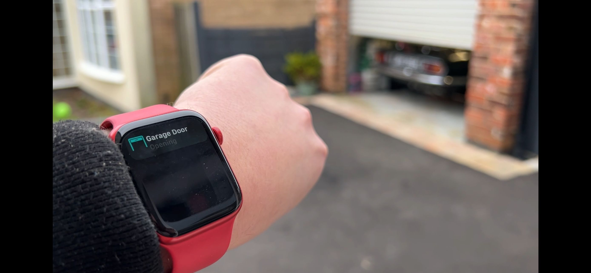
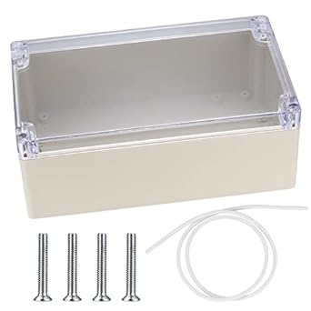
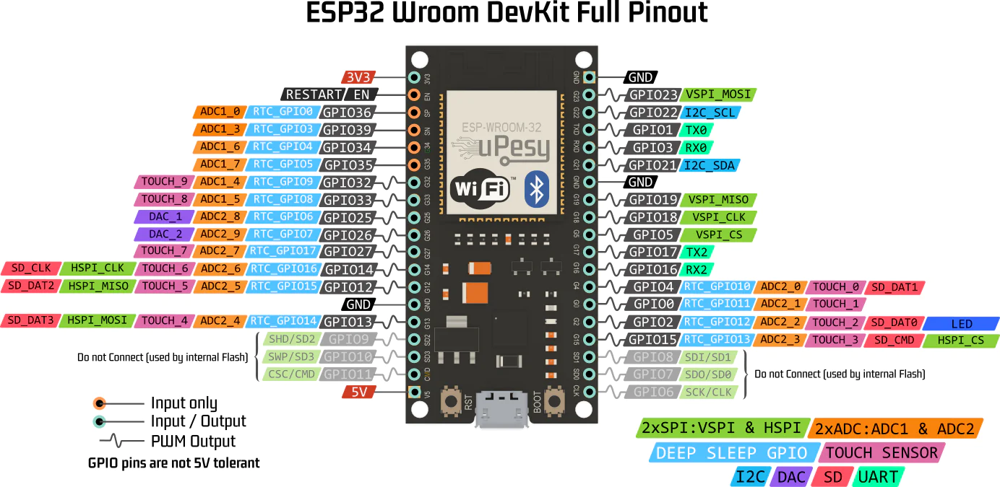

# Gliderol2MQTT
## A smart home interface for Gliderol Electric Garage Doors driven by Glidermatic controllers.
Gliderol2MQTT (or G2M for short) is a smart home remote control and monitoring interface for Gliderol Electric Garage Doors which are driven by Glidermatic controllers.


Let's be honest.  Gliderol garage doors are pretty awesome out of the box, but what if we could make them a bit smarter?  Say, hook them into your Apple Home, Google Assistant, Amazon Alexa or Home Assistant?  Well, now you can.  And you can do it without a soldering iron.  Communication with Gliderol2MQTT is via MQTT and can be driven by home integration solutions such as [Home Assistant](https://www.home-assistant.io/), [Node-Red](https://nodered.org/) and anything else which is MQTT compatible.  It has in-built compatibility with [Homebridge](https://homebridge.io/) and the [Homebridge MQTT-Thing](https://github.com/arachnetech/homebridge-mqttthing) plugin so you can control and monitor your garage door natively from your iPhone/Apple Watch/HomePod with your voice or via the app.  It's as simple as saying "Hey Siri, close the garage door."

Further, as the project is low power and makes use of the 12V/GND/UP/DOWN/STOP screw terminals on the PCB of the Glidermatic controller, it can be powered by the Glidermatic controller itself and so it doesn't need its own power supply.  It supports an optional OLED display for your project box and an optional Micro-SD card reader for changing settings without needing to re-flash the ESP32 each time.  The slightly simpler implementation only requires a roller shutter door sensor on the floor to work, reporting Open / Closed / Opening (Fob/Button/MQTT) / Closing (MQTT).  For best results however, an optional spring actuator limit switch at the top is supported to report the full Open / Stopped / Closed / Opening (Fob/Button/MQTT) / Closing (Fob/Button/MQTT) range of states.

It's designed to run on an ESP32 microcontroller with a small amount of supporting components.  Estimated cost to build is around £40 for the simpler implementation and £65 for the full on implementation... But the kudos is priceless :D.

### Supported devices are:
```
GLIDERMATIC GRD,
GLIDERMATIC GTS / GTS+,
*Others models which expose 12V, GND, UP, STOP and DOWN terminals on the PCB will work too.  Be sure to let me know if yours needs adding!
**There are models which just have a 12V, GND, ST (Start).  Whilst I don't have this model, in theory, Gliderol2MQTT will work just fine, leveraging just one relay for START.  I would love to hear from and work with you if you have model like this so that the project can be refined for you and all.
```

<a href="Pics/Assembly/Finished2.JPG" target="_new"></a>


*Watch the video of my implementation here:*


<a href="https://www.youtube.com/watch?v=oe4l3DesHIw" target="_new"></a>


We will run through the communications first, we will then look at building and implementation before finally plumbing it into Homebridge or Home Assistant and demonstrate how it all comes together.  I have been running my Gliderol2MQTT for over a year.  I debated whether to release it to the public because it is such a great device it could have been a small side income stream, however, I ultimately decided to release the design and code to the public.  This is not a two minute project.  It is a weekend fun project which involves everything from a bit of DIY, some easy electronics and a teeny bit of ESP32 flashing in the Arduino IDE.  Have a marathon approach to this project in your head, a sprint will only frustrate you.  I will endeavour to help if you get stuck.  Try email or [Facebook](https://www.facebook.com/mydan100/).


Enjoy.


(c) Daniel Young 2022/23/24 [daniel@mydan.com](daniel@mydan.com)


# MQTT Communication
## Connection Established / Dropped
Gliderol2MQTT needs WiFi access and a connection to an MQTT broker to work.  If MQTT communication is lost for five seconds due to patchy WiFi or network outage, Gliderol2MQTT will show as offline.  But rest assured, Gliderol2MQTT will always endeavour to reconnect to both WiFi and MQTT as soon as possible.  Use the following MQTT topic for Birth and Last Will and Testament, which you can use to indicate to HomeKit and Home Assistant that the device is online or offline:
```
Gliderol2MQTT/connection_status
```

### Birth
When connection to the MQTT broker is established, it will post a retained MQTT message to Gliderol2MQTT/connection_status with the following payload:
```
true
```
Where true means Gliderol2MQTT is online.  Gliderol2MQTT is assumed as online from then on - until communication is lost.

### Last Will and Testament
As stated, when MQTT communication is lost for five seconds, your MQTT broker will send out the Last Will and Testament for Gliderol2MQTT.  It is a retained MQTT message to Gliderol2MQTT/connection_status with the following payload:
```
false
```
Where false means Gliderol2MQTT is offline.


## Current State
The MQTT topic to subscribe to is:
```
Gliderol2MQTT/get/current/door/state
```
### get/current/door/state
To keep your home automation tools informed as to your garage door's current state, Gliderol2MQTT publishes this topic every five seconds.  This topic is also published on demand when there is either a change of floor sensor or top sensor state, or when you tell Gliderol2MQTT to do something.  For example, if you instruct Gliderol2MQTT to open the door via an MQTT message, the topic will be published immediately.  If there is a change in door state by way of using the keyfob or push button on the Glidermatic, it will likewise publish the topic immediately.   To take two real life examples a bit further, if you send Gliderol2MQTT a message to shut the door, this will return 'c' (Closing) for a time period* and then, if the door has fully shut, return 'C' (Closed) from then on.  Similarly, if you use the fob to open the door from a fully closed position, this will return 'o' (Opening) for a time period* and then, if the door has fully opened, return 'O' (Open) from then on.  If the door has not reached its target state by the end of the time period* it will report 'S' (Stopped).

```
o - The door is currently Opening.
O - The door is currently Open.
c - The door is currently Closing.
C - The door is currently Closed.
S - The door is currently Stopped.
```

*Time Periods are customisable numbers of seconds it takes for your garage door to both open from a fully closed position or close from a fully open position - as these are all dependent on the model and the height of the door.*


*Without the top sensor as part of your implementation, only 'o' and 'O' can be reported on change of floor sensor state or if you instruct Gliderol2MQTT to open the door by way of an MQTT message.  Further, 'c' and 'C' can only be reported when the door is fully shut or if you instruct Gliderol2MQTT to close the door by way of an MQTT message.  This is because a change in top sensor state is required to determine if you close the door with the keyfob or push button on the Glidermatic.  'S' cannot be reported without the top sensor as both sensor states need to be known to determine if the door is stopped somewhere between.*


## Target State
The MQTT topic to subscribe to is:
```
Gliderol2MQTT/get/target/door/state
```
### get/target/door/state
This informs your home automation tool as to what the target door state is and is only sent out on demand.  Take two examples, if you send Gliderol2MQTT a message to shut the door, this will return 'C' (Closed) - Our target is an eventual closed position.  And if you press the keyfob to open the door from a fully closed position, this will return 'O' (Open) - Our target is an eventual open position.  

*Without the top sensor as part of your implementation, only 'O' can be reported on change of floor sensor state or if you instruct Gliderol2MQTT to open the door by way of an MQTT message.  Further, 'C' can only be reported when the door is fully shut or if you instruct Gliderol2MQTT to close the door by way of an MQTT message.  This is because a change in top sensor state is required to determine if you close the door with the keyfob or push button on the Glidermatic.*
```
O - The door is working towards its Open position.
C - The door is working towards its Closed position.
```


## Requesting States
You can ask Gliderol2MQTT about the state of the door as it is right now.  The MQTT topics to publish empty payloads to are:
```
Gliderol2MQTT/request/is/open
Gliderol2MQTT/request/is/closed
Gliderol2MQTT/request/is/stopped
```

### request/is/open
Following an empty payload published to the topic 'Gliderol2MQTT/request/is/open', you will receive a response on Gliderol2MQTT/response/is/open.  The response payload is JSON akin to the following:
```
{
    "open": %s
}
```
Where %s is true (Door open) or false (Door closed.)


### request/is/closed
Following an empty payload published to the topic 'Gliderol2MQTT/request/is/closed', you will receive a response on Gliderol2MQTT/response/is/closed.  The response payload is JSON akin to the following:
```
{
    "closed": %s
}
```
Where %s is true (Door closed) or false (Door open.)


### request/is/stopped
Following an empty payload published to the topic 'Gliderol2MQTT/request/is/stopped', you will receive a response on Gliderol2MQTT/response/is/stopped.  The response payload is JSON akin to the following:
```
{
    "partiallyopen": %s
}
```
Where %s is true (Door partially open) or false (Door fully closed or open.)

*When you leverage a top sensor as part of your implementation.*


## Requesting Actions
You can ask Gliderol2MQTT to open, close or stop the door from home automation tools such as Home Assistant or Node Red.  The MQTT topics to publish empty payloads to are:
```
Gliderol2MQTT/request/perform/close
Gliderol2MQTT/request/perform/open
Gliderol2MQTT/request/perform/stop
```

If you are integrating with HomeKit using Homebridge and MQTT-Thing, Gliderol2MQTT has you covered.  You use this topic instead:
```
Gliderol2MQTT/set/target/door/state
```


### set/target/door/state
This topic instructs Gliderol2MQTT to open (O) or close (C) the door.  Simply publish a message to this topic with a single character payload, the letter C or letter O.  This works out of the box with MQTT-Thing but can also be used in any other home automation tools too.
```
O - The door is working towards its Open position.
C - The door is working towards its Closed position.
```
Once you have published to this topic, you will receive the same payload back to 'Gliderol2MQTT/get/target/door/state' as confirmation that the target was set.


*This indicates the action was triggered, but does not guarantee anything.  Your home automation will use the current state to report the outcome over time.*

### request/perform/close
Following an empty payload published to the topic 'Gliderol2MQTT/request/perform/close', you will receive a response on Gliderol2MQTT/response/perform/close.  The response payload is JSON akin to the following:
```
{
    "statusValue": "setCloseSuccess"
	,"done": true
}
```
*This indicates the action was triggered, but does not guarantee anything.  Your home automation will use the current state to report the outcome over time.*


### request/perform/open
Following an empty payload published to the topic 'Gliderol2MQTT/request/perform/open', you will receive a response on Gliderol2MQTT/response/perform/open.  The response payload is JSON akin to the following:
```
{
    "statusValue": "setOpenSuccess"
	,"done": true
}
```
*This indicates the action was triggered, but does not guarantee anything.  Your home automation will use the current state to report the outcome over time.*


### request/perform/stop
Following an empty payload published to the topic 'Gliderol2MQTT/request/perform/stop', you will receive a response on Gliderol2MQTT/response/perform/stop.  The response payload is JSON akin to the following:
```
{
    "statusValue": "setStopSuccess"
	,"done": true
}
```
*This indicates the action was triggered, but does not guarantee anything.  Your home automation will use the target and current states to report the outcome.*


## Other MQTT Topics
There are other topics which were implemented to assist in development.  They are listed below but without too much by way of detail.  They set, clear and return the individual ESP32 pin values for the relays driving the garage door and the sensor values.  You shouldn't need them, but it gives those of you who investigate the source code in depth some context.
```
Gliderol2MQTT/request/value/pin/close, Response via Gliderol2MQTT/response/value/pin/close
Gliderol2MQTT/request/value/pin/stop, Response via Gliderol2MQTT/response/value/pin/stop
Gliderol2MQTT/request/value/pin/open, Response via Gliderol2MQTT/response/value/pin/open
Gliderol2MQTT/request/value/pin/top_sensor, Response via Gliderol2MQTT/response/value/pin/top_sensor
Gliderol2MQTT/request/value/pin/bottom_sensor, Response via Gliderol2MQTT/response/value/pin/bottom_sensor

Gliderol2MQTT/request/set/value/pin/close, Response via Gliderol2MQTT/request/set/value/pin/close
Gliderol2MQTT/request/set/value/pin/stop, Response via Gliderol2MQTT/request/set/value/pin/stop
Gliderol2MQTT/request/set/value/pin/open, Response via Gliderol2MQTT/request/set/value/pin/open

Gliderol2MQTT/request/clear/value/pin/close, Response via Gliderol2MQTT/request/clear/value/pin/close
Gliderol2MQTT/request/clear/value/pin/stop, Response via Gliderol2MQTT/request/clear/value/pin/stop
Gliderol2MQTT/request/clear/value/pin/open, Response via Gliderol2MQTT/request/clear/value/pin/open
```


# How To Build
## Parts List
1. An ESP32 microcontroller

2. A 3-channel 3.3V DC relay board

3. A prototyping board - 120mm x 80mm

4. A 12V to 5V step down buck converter*

5. A 4-pin IIC 128x64 OLED Screen (optional)

6. A Micro-SD Card Reader (optional)

7. A roller shutter door sensor

8. A spring actuator limit switch (optional)

9. Some 5 Core 30 AWG Cable**

10. Some 2 Core 30 AWG Cable***

11. A project box to put it all in

12. Miscellaneous 2.54mm pitch male and female headers, and mix of varying length Female-Female (F-F) jumper wires


*I have designed this project with zero soldering in mind, but ultimately my personal implementation does use soldering as I have a small soldering kit and I'm pretty competent at it and it made for a slightly tidier job.  You will be able to implement this entirely solderless using breadboards.  The only component where I couldn't find a pre-soldered equivalent was the 12V to 5V converter.  I suspect they will be available if you search a little harder than I did.  I like the 12V to 5V converter as it means the whole thing can be powered from the Glidermatic itself but it isn't essential as you could use your own Micro-USB power supply for the ESP32.


** You will need enough 5 core cable to reach from your Glidermatic to wherever you fix your Gliderol2MQTT.  I listed the item below but you can do as I did, position it near the glidermatic and use any spare 1m network cable you have lying around if you want to save yourself a bit of money.  Black is likely to be a better colour for the project.


*** You will need enough 2 core cable to reach from your Gliderol2MQTT to the bottom sensor, and optionally, a second length from your Gliderol2MQTT to the top sensor, if you choose to implement the top sensor.  Black is likely to be a better colour for the project.


### ESP32 + optional case : ESP32-WROOM-32E : Development Board Dual Core : LATEST!


Forgoe the box.  I guess any ESP32 variant will do, but I use the 38 pin version with 3V3 and GND at the top left and right respectively.  I bought [for £6.95 including P&P](https://www.ebay.co.uk/itm/195866751998)


### DC 3.3V 5V 3-Channel Relay Module With Optocoupler Isolation Compatible Signal


I bought [for £4.69 including P&P](https://www.ebay.co.uk/itm/254991837221)

*Note that this relay board is powered by 5V to activate the relays, however is driven by 3.3V signals.  You may find a relay board which can be powered by 3.3V too and you will need to adjust your build below such that you have a 3.3V rail to share with any other 3.3V devices, such as the display.*


### Prototype Board - Double Sided - 80x120mm - 8x12cm Green / Silver - UK Free P&P


I bought [this for £2.99 including P&P](https://www.ebay.co.uk/itm/266162433248)


### Mini560 5V-20V To 3.3V/5V/9V/12V 5A Step Down Buck Converter Power Supply -UK


You want the 5V output variant.  I bought [this for £3.90 including P&P](https://www.ebay.co.uk/itm/194950043266?var=494844251955)


### 1.3" 128x64 IIC I2C OLED LCD Display Module for Arduino White SOLDERED


You want the IIC (aka I2C) 4-pin (VCC,GND,SCK,SDA) variant with the SH1106 driver.  I bought [this for £5.99 including P&P](https://www.ebay.co.uk/itm/234964172688)


### 2pcs Micro SD Card Adapter Module 6 Pin SPI for Microcontroller ESP32 ESP8266


I bought [this 2-pack for £3.52 including P&P](https://www.ebay.co.uk/itm/394519186781)

*Note that this Micro-SD card reader is powered by 5V, however is driven by 3.3V signals.  You may find a card reader which can be powered by 3.3V too (such as the Wemos Lolin SD-Card Reader) and you will need to adjust your build below such that you have a 3.3V rail to share with any other 3.3V devices, such as the display.*


### Knight F10A Roller Shutter Switch Door Contact Alarm Switch Sensor Normally Open


I bought [this for £12.95 including P&P](https://www.ebay.co.uk/itm/224354305842)


### IP65 Spring Actuator Limit Switch NO/NC 250V 5A


I bought [this for £9.99 including P&P](https://www.ebay.co.uk/itm/255671000806)


### 16~30 AWG PVC Multi Core Power Wire 2/3/4/5/6/7/8/9/10 Core Signal Control Cable


I used a spare network cable, but you can buy lengths [from £3.49 including P&P](https://www.ebay.co.uk/itm/404344258322)


### 16~30 AWG PVC Multi Core Power Wire 2/3/4/5/6/7/8/9/10 Core Signal Control Cable


I used a spare length of telecoms cable, but you can buy 10m lengths [from £5.28 including P&P](https://www.ebay.co.uk/itm/404344258322)


### IP65 Waterproof Junction Box, Electronics Project Box, Plastic Clear Cover Project Junction Box Enclosure Case, Electrical Box Outdoor Cable Connector Boxes


You want the 200mm x 120mm x 75mm variant.  I bought [this for £8.59 including P&P](https://www.amazon.co.uk/gp/product/B0B2MJH7Q5/ref=ppx_yo_dt_b_search_asin_title?ie=UTF8&th=1)


### 40pin 2.54mm Single Row Male Pin Header for Arduino uno MINI R3 ETC snap to size


You can buy male headers [here](https://www.ebay.co.uk/itm/123991187180)


### Single Row Round Hole Female Header Pin Header 2.54MM 1*4/40P 2*40 Gold Plated


You can buy female headers [here](https://www.ebay.co.uk/itm/354733633355)


### 40 PIN DUPONT WIRE BREADBOARD JUMPER WIRES RIBBON CABLES M-F/M-M/F-F 10/20/30CM


You can buy a selection of jumper wires (though I only use Female-Female between 10cm and 15cm) [here](https://www.ebay.co.uk/itm/223760125560)


What I would consider a 'Gold Standard' approach of both sensors, Micro-SD card reader and OLED screen, plus a nominal £5 for bits and bobs will set you back around £65, including 10m of 2 core cable and 1m of 5 core cable.  A slimmed back implementation with no Micro-SD card reader, no OLED screen, just the floor sensor and cables you have lying around will set you back around £40.


## Schematic and ESP32 Pinout
The full schematic is below and you can click on it to open a larger copy.  This is what we will be building today.

<a href="Pics/Schematic.PNG" target="_new"></a>

You can download a PDF of the schematic [here](Pics/Schematic.pdf).


The ESP32 pinout is here for your reference and you can click on it to open a larger copy.  Credit to [uPesy](https://www.upesy.com/blogs/tutorials/esp32-pinout-reference-gpio-pins-ultimate-guide) for creating this image as part of their awesome guide.

<a href="Pics/doc-esp32-pinout-reference-wroom-devkit.webp" target="_new"></a>


## Construction
### Device Placement
Click any image for a full size copy.  I will build mine using some soldered components on a prototyping board.  If you are building on breadboards simply plug and play.  My prototyping board will be positioned in portrait.  I would never recommend soldering components directly to the board.


Start by soldering 2 x 19 pin female headers and 2 x 19 pin male headers to the far most bottom right of the prototyping board vertically.  I had some plastic female headers handy so used those.  On the underside, solder equivalent pins adjacent to each other.  This will give us a male pin for every pin of the ESP32 and give us a removable socket for swapping out the ESP32, should we need to.


<a href="Pics\Assembly\Assembly1.JPG" target="_new"></a>


<a href="Pics\Assembly\Assembly2.JPG" target="_new"></a>


<a href="Pics\Assembly\Assembly3.JPG" target="_new"></a>


I'll be honest, I didn't bother soldering all the equivalent pins when it became apparent it was going to be more effort than it was worth.  I soldered all the corners and then ensured that the pins in use in the project (5V/GND/3v3/GPIOs 23,22,21,19,18,5,32,33,25,26,27) had equivalents.  Ensure you don't have any shorts.  It ended up looking like this:


<a href="Pics\Assembly\Assembly4.JPG" target="_new"></a>


Next, at the bottom left of the board, we will make an interface port.  Solder 2 x 9 pin male headers vertically.  On the underside, solder equivalent pins adjacent to each other.  This will give us a male pin for each of the 12V, GND, UP, STOP, DOWN from the Glidermatic, as well as 2 pins each for the top and bottom door sensors.  Solder one final 1 x 1 pin male at the top and likewise solder underneath to the existing 12V pair.  In effect you'll end up with 2 columns of 9, and 1 column of 1.  Soldering the adjacent pins will give us a male pin for all the inputs and outputs from Gliderol2MQTT, bar 12V which will get two outputs.  Take out a sharp permenant marker and write the following beside each pin, from top to bottom, 12, G, U, S, D, T1, T2, B1, B2.


<a href="Pics\Assembly\Assembly6.JPG" target="_new"></a>


<a href="Pics\Assembly\Assembly7.JPG" target="_new"></a>


Next, solder some male pins to the 12V-5V converter.  The converters I got don't conform to 2.54mm as per prototyping, but are close enough to get away with slight bends.


<a href="Pics\Assembly\Assembly5.JPG" target="_new"></a>


Look at the relay board and identify common and normally open.  I wrote O and | and C for Open, Common and Closed respectively.  This is because when the board is fixed to the prototyping board you won't see the circuit diagram anymore.


<a href="Pics\Assembly\Assembly8.JPG" target="_new"></a>


Take the relay board and place it at the far top right of the prototyping board vertically with the relay outputs pointing towards the inside of the board.  You have a choice, you can use a felt-tip to mark holes and, using an appropriate drill, drill holes in the prototype board and use small factor bolts and washers to mount the relay board to the prototyping board.  Alternatively, if you feel comfortable using hot melt glue, you can use that.


Take the Micro-SD card reader and place vertically next to the ESP32 such that the card can be ejected from the edge.  Again, you have a choice, you can use a felt-tip to mark holes and, using an appropriate drill, drill holes in the prototype board and use small factor bolts and washers to mount the SD card reader to the prototyping board.  Alternatively, if you feel comfortable using hot melt glue, you can use that.


At this point, your prototyping board should look similar to this:


<a href="Pics\Assembly\Assembly9.JPG" target="_new"></a>


Next, slightly in from the top left of the board, solder 2 x 7 pin female headers to the board such that the 12V-5V converter will push in vertically.  You want the 12V side at the top and the 5V side at the bottom.  The middle three pins of the headers are redundant.  Further, solder pairs of adjacent male headers next to the female headers and solder them to the adjacent pins underneath to give us a male pin for inputs and outputs of the converter.  Your prototyping board should be coming along nicely:


<a href="Pics\Assembly\Assembly10.JPG" target="_new"></a>


<a href="Pics\Assembly\Assembly11.JPG" target="_new"></a>


Next, we need to make some rails for devices to share.  We need one for 5V, one for GND.


We have six devices which need a GND connection and one device which will supply the GND.  The ESP32, relay board, Micro-SD card reader, OLED display, bottom switch, top switch and the output from the 12V-5V converter.  As such, solder a set of eight male headers (to allow for future project growth) vertically to the left side of the board beneath the converter.  On the underside, ensure all the pins are soldered together.  Using the sharp permenant marker, write GND beside it.

Similarly, we have three devices which need a 5V connection and one device which will supply the 5V.  The relay board, Micro-SD card reader, ESP32 and the supply 5V output from the converter respectively.  As such, solder eight male headers to the right of the GND rail.  Leave some breathing space.  On the underside, ensure all the pins are soldered together.  Using the sharp permenant marker, write 5V beside it.


*It is at this point I'll remind you that if you have sourced a relay board or Micro-SD card reader which require a 3.3V supply, it will be prudent now to take another set of male headers and solder them to the middle of the board somewhere.  On the underside, likewise, ensure all the pins are soldered together.  Using the sharp permenant marker, write 3.3V beside it*


<a href="Pics\Assembly\Assembly12.JPG" target="_new"></a>


<a href="Pics\Assembly\Assembly13.JPG" target="_new"></a>


This is a quick fun bit, push the ESP32 into its new home so the Micro-USB is at the bottom.  The display will float on wires and, using some double-sided clear tape or hot melt glue, will be fastened to the front of the project box.


### Wiring
Let's now wire up the relays.  I like to use yellow for 12V.  Seeing as I had loads of jumper wires left over of various types, I just snipped and trimmed end(s) off F-F jumper wires as appropriate.


1. Use a F-F jumper wire, cut off, trim back and twist tight one end.  Plug the female end on the middle 12V pin of the interface port to COM (Usually middle pin) on CH3's relay
2. Join CH3 COM (Usually middle pin) to CH2 COM (Usually middle pin)
3. Join CH2 COM (Usually middle pin) to CH1 COM (Usually middle pin)


Alternatively, you can prepare the wire in advance like so by trimming appropriate lengths, twisting together meaning you only need to push one thing into the relays:


<a href="Pics\Assembly\Assembly14.JPG" target="_new"></a>


<a href="Pics\Assembly\Assembly15.JPG" target="_new"></a>


For the Normally Open outputs of the relays, follow these steps:


1. Use a F-F jumper wire, cut off, trim back and twist tight one end.  Plug the female end on the right side U of the interface port to Normally Open (NO) (Usually top pin as viewed from above) on CH1's relay
2. Use a F-F jumper wire, cut off, trim back and twist tight one end.  Plug the female end on the right side S of the interface port to Normally Open (NO) (Usually top pin as viewed from above) on CH2's relay
3. Use a F-F jumper wire, cut off, trim back and twist tight one end.  Plug the female end on the right side D of the interface port to Normally Open (NO) (Usually top pin as viewed from above) on CH3's relay


And now all the jumper wires.  This is slightly less fun, but still a satisfying thing to do.
1. Use a F-F jumper wire to connect the right most 12V of the interface port to the 12V input of the converter
2. Use a F-F jumper wire to connect the right most GND to the GND input of the converter
3. Use a F-F jumper wire to connect the 5V output from the converter to the 5V rail
4. Use a F-F jumper wire to connect the GND output from the converter to the GND rail
5. Use a F-F jumper wire to connect the right most B1 of the interface port to the GND rail
6. Use a F-F jumper wire to connect the right most T1 of the interface port to the GND rail
7. Use a F-F jumper wire to connect the GND rail to GND on the Micro-SD card reader
8. Use a F-F jumper wire to connect the GND rail to GND on the relay board
9. Use a F-F jumper wire to connect the GND rail to GND on the display
10. Use a F-F jumper wire to connect the GND rail to GND on the ESP32
11. Use a F-F jumper wire to connect the 5V rail to 5V on the ESP32
12. Use a F-F jumper wire to connect the 5V rail to 5V on the Micro-SD card reader
13. Use a F-F jumper wire to connect the 5V rail to 5V on the relay board
14. Use a F-F jumper wire to connect GPIO23 (VSPI_MOSI) on the ESP32 to MOSI on the Micro-SD card reader
15. Use a F-F jumper wire to connect GPIO19 (VSPI_MISO) on the ESP32 to MISO on the Micro-SD card reader
16. Use a F-F jumper wire to connect GPIO18 (VSPI_CLK) on the ESP32 to SCK on the Micro-SD card reader
17. Use a F-F jumper wire to connect GPIO5 (VSPI_CS) on the ESP32 to CS on the Micro-SD card reader
18. Use a F-F jumper wire to connect GPIO22 (I2C_SCL) on the ESP32 to SCK on the display
19. Use a F-F jumper wire to connect GPIO21 (I2C_SDA) on the ESP32 to SDA on the display
20. Use a F-F jumper wire to connect 3.3V on the ESP32 to 3.3V on the display
21. Use a F-F jumper wire to connect GPIO32 on the ESP32 to CH1 on the relay board
22. Use a F-F jumper wire to connect GPIO33 on the ESP32 to CH2 on the relay board
23. Use a F-F jumper wire to connect GPIO25 on the ESP32 to CH3 on the relay board
24. Use a F-F jumper wire to connect GPIO26 on the ESP32 to the right side T2
25. Use a F-F jumper wire to connect GPIO27 on the ESP32 to the right side B2


Your prototyping board will look like so, however note that at this point on the photographs I have not plugged in the four wires of the display yet as I will do so when it comes to mounting in the project box out in the garage:


<a href="Pics\Assembly\Assembly17.JPG" target="_new"></a>


<a href="Pics\Assembly\Assembly18.JPG" target="_new"></a>


<a href="Pics\Assembly\Assembly19.JPG" target="_new"></a>


The left side T1 and T2 pins of the interface port will connect to the top sensor and the left side B1 and B2 pins of the interface port will connect to the bottom sensor.  The left side 12V, GND, U, S and D pins will connect to the equivalents on the Glidermatic.


### Glidermatic Interface Cable
Finally, we need some cables.  First, lets make the one which will interface to the Glidermatic.  Cut a length of cable suitable to reach between your Glidermatic and the where you will place the project.  Take into account things such as clipping to walls, working around things, along roof space, and the like.  When you are happy, strip back the outer sheath 5cm and trim back 1cm from each of the five wires inside.  Fold them back on each other and twist them.  This will double the amount of wire you can place into the screw terminal.  The Glidermatic side will look like something like this:

<a href="Pics\Assembly\InterfaceGlidematicSide.JPG" target="_new"></a>


And, this is a nasty approach and you are welcome to improve on it, I did the same on the other side, but this time trimming 7cm outer sheath and 3cm inner but I also cut off the ends of five F-F jumper wires, trimmed the sheath back the same way and twisted them with each of the five wires in the cable.  Finally, I used heat-shrink on each each individually to complete.  You could use black electrical tape.


<a href="Pics\Assembly\InterfaceGliderol2MQTTSide1.JPG" target="_new"></a>


<a href="Pics\Assembly\InterfaceGliderol2MQTTSide2.JPG" target="_new"></a>


<a href="Pics\Assembly\InterfaceGliderol2MQTTSide3.JPG" target="_new"></a>


<a href="Pics\Assembly\InterfaceGliderol2MQTTSide4.JPG" target="_new"></a>


<a href="Pics\Assembly\InterfaceGliderol2MQTTSide5.JPG" target="_new"></a>

I thought to put screw terminals on the Gliderol2MQTT but I wanted some quick flexibility to plug/unplug.  Perhaps you can get a cheap tool to crimp female jumpers to the end of wires, but that was beyond what I needed.  Use a little bit of masking tape on each of the five cores on each side to identify 12V, GND, U, S, D.  You are free to use whatever colours you choose.


The two ends should look like this:


<a href="Pics\Assembly\InterfaceGliderol2MQTTSide6.JPG" target="_new"></a>


Open the Glidermatic, identify the five screw terminals and screw in each of the five wires.  For the avoidance of doubt 12V goes to 12, GND to G, U to the Up arrow, S to the square and D to the Down arrow.  Put the cover back on the Glidermatic, and tack/fasten the wire up roughly to where you will be putting your Gliderol2MQTT.  As my project box will be next to the Glidermatic, I cable tied the interface cable to the Glidermatic power cable.  Leave the other end free standing for now.  Don't kill yourself, turn off the power and be sure.


<a href="Pics\Assembly\GlidematicPort.JPG" target="_new"></a>


<a href="Pics\Assembly\GlidematicWired.JPG" target="_new"></a>


<a href="Pics\Assembly\Glidematic.JPG" target="_new"></a>


### Bottom Sensor Cable
This cable just acts as a switch to sever (open) or complete (open) a circuit.  Measure a length of cable from where the floor sensor will go back to the Gliderol2MQTT's future home.  Again, pay respects to how you will route the cable back.  Strip back 3cm of outer sheath and trim back 1cm from each of the two wires inside.  Fold them back on each other and twist them.  In a similar nasty approach, leverage two F-F jumper wires and connect two to one side of the cable.  The cable will plug onto B1 and B2 of the Gliderol2MQTT of the Gliderol2MQTT.


It will look something like this (the blue ones):


<a href="Pics\Assembly\ProjectBoxSensorWiresReady.JPG" target="_new"></a>


It is worth noting the floor sensor may come with a metal sheath and a cable with a connector.  I employed my usual nastiness and hacked off the connector to expose the two wires.  Twist each of the wires in the cable you have just made to the exposed wires, heat shrink or tape the inner cores and finally heat shrink or tape over the outer sheaths.  The colouring and match doesn't matter.  It will look like this:


<a href="Pics\Assembly\FloorSensor.JPG" target="_new"></a>


Install the floor sensor by drilling a couple of holes in the floor, snug sized wall plugs and screws.  Tack the cable appropriately up to where your Gliderol2MQTT will be housed.  Leave the other end free for now, we will plug that in to finish.  Fasten the magnetic block to your garage door.  I found it screwed and sat beautifully with my garage door.  It looks like this for me:


<a href="Pics\Assembly\DoorMagnet1.JPG" target="_new"></a>


<a href="Pics\Assembly\FloorSensorAndDoorMagnet1.JPG" target="_new"></a>


<a href="Pics\Assembly\FloorSensorAndDoorMagnet2.JPG" target="_new"></a>


### Top Sensor Cable
This cable just acts as a switch to sever (open) or complete (open) a circuit.  Measure a length of cable from where the top sensor will go back to the Gliderol2MQTT's future home.  Again, pay respects to how you will route the cable back.  Strip back 3cm of outer sheath and trim back 1cm from each of the two wires inside.  Fold them back on each other and twist them.  In a similar nasty approach, leverage two F-F jumper wires and connect two to one side of the cable.  The cable will plug onto T1 and T2 of the Gliderol2MQTT of the Gliderol2MQTT.


It will look something like this (the white ones):


<a href="Pics\Assembly\ProjectBoxSensorWiresReady.JPG" target="_new"></a>


The top sensor has four terminals.  Two for Normally Closed (NC) and two for Normally Open (NO).  We want to connect our two cables to the Normally Open pair.  That is, the circuit is not complete unless the spring is bent.  It doesn't matter which of the two wires you screw to the terminals.  Just use the NO pair.


Install the top sensor by appropriately installing a bracket to be screwed in a position which will allow the spring to bend when the magnet block you have just installed comes up when the door has fully opened.  Be sure to check my video for how this works in practice if you are unsure.  Tack the cable appropriately up to where your Gliderol2MQTT will be housed.  Leave the other end free for now, we will plug that in to finish.  It looks like this for me:


<a href="Pics\Assembly\SpringActuator.JPG" target="_new"></a>


### Project Box and Mounting
Finally, fix your project box to the wall.  Before you do, decide if you are affixing a backplate (I used a small sheet of 6mm MDF) to the box and if this affects your mounting.  You could affix a back plate with hot melt glue or you can screw it through.  I would recommend you do this first before mounting to the wall.  It looks like this for me:


<a href="Pics\Assembly\ProjectBoxAllWiresReady.JPG" target="_new"></a>


<a href="Pics\Assembly\ProjectBoxAndGlidematicReady.JPG" target="_new"></a>


When we have finished programming the ESP32 and made sure everything behaves as well as to be expected without sensors and switches connected, we will screw the prototyping board to the backplate using some short self-tapping screws with washers.  We will affix to the project box and plug in the final wires.


# Programming
## Configuration
Download the Gliderol2MQTT.ino and Definitions.h source files into a folder called Gliderol2MQTT.

Configure your Gliderol2MQTT by opening up Definitions.h and verifying/customising the following definitions for your need:
```
- Set WIFI_SSID to your WiFi Access Point name
- Set WIFI_PASSWORD to your WiFi password
- Set MQTT_SERVER to your MQTT broker IP
- Set MQTT_PORT to your MQTT broker port (Default is 1883)
- Set MQTT_USERNAME to a username configured in your MQTT broker
- Set MQTT_PASSWORD to a password configured in your MQTT broker
- Set DEVICE_NAME to a different name if you wish.  NB: The device name is used as the MQTT base topic and presence on the network.  This is useful if you have more than two Glidermatics and wish to control all
- Set USING_TOP_SENSOR to true if you are using the top sensor, otherwise change to false
- Set TIME_TO_FULLY_OPEN_FROM_FULLY_CLOSED to the number of milliseconds it takes your garage door to go from fully open to fully closed.  Essentially, start it opening and count how long before it reaches the top.  Add one second for tolerance.  I found 10 seconds (10000) was great for my door.  In effect, when you open the garage door with an MQTT message or when Gliderol2MQTT senses it is opening thanks to a change in the bottom sensor, Gliderol2MQTT will reporting Opening for this period of time before falling back to inform based on what the sensors are saying
- Set TIME_TO_FULLY_CLOSED_FROM_FULLY_OPEN to the number of milliseconds it takes your garage door to go from fully closed to fully open.  Essentially, start it closing and count how long before it reaches the bottom.  Add one second for tolerance.  I found 10 seconds (10000) was great for my door.  In effect, when you close the garage door with an MQTT message or when Gliderol2MQTT senses it is opening thanks to a change in the top sensor, Gliderol2MQTT will reporting Closing for this period of time before falling back to inform based on what the sensors are saying
- Set NORMALLY_OPEN to HIGH if your relay board flips to a normally open (NO) state when 3.3V (HIGH) is received.  If your relay flips to a normally open (NO) state when GND (LOW) is received set to LOW.
- Set NORMALLY_CLOSED to LOW if your relay board flips to a normally closed (NC) state when GND (LOW) is received.  If your relay flips to a normally closed (NC) state when 3.3V (HIGH) is received set to HIGH.
- Set BOOT_UP_TARGET_STATE to 0 if you want, on boot up, Gliderol2MQTT to leave the last known retained target state in the MQTT broker as is (default), set to 1 if you wish to post a target state of Closed on boot up or set to 2 if you wish to post a target state of Open on boot up.
```

## Software Configuration
### Drivers
Download and install the [Wemos CH340 Driver](https://www.wemos.cc/en/latest/ch340_driver.html).
### Arduino IDE
Download and install the [Arduino IDE](https://www.arduino.cc/en/software).
### ESP32 Libraries
Once installed and set up, you'll need the libraries for the ESP32. Follow [this guide](https://randomnerdtutorials.com/installing-esp32-arduino-ide-2-0/) if you haven't completed that step before.
### Other Libraries
Add a few more libraries using the Tools / Manage Libraries menu:

1. PubSubClient by Nick O'Leary

2. Adafruit GFX by Adafruit

3. Adafruit SH110X by Adafruit

(Even if you are not using the OLED screen you need install the Adafruit libraries or it will not compile.)

Choose NodeMCU-32S as your board, choose the COM port for your board ...and upload.

After uploading, you should see activity on your screen.  Like so:


<a href="Pics\Assembly\OnBenchWithDisplay.JPG" target="_new"></a>


Ideally it will connect to WiFi (confirming those details are right) and connect to MQTT (confirming those details are right) and you should be left with a screen which shows, in effect, a garbage garage door status.  You should see periodic messages on your MQTT broker.  I suggest using [MQTT Explorer](https://mqtt-explorer.com/).  Congratulations.  You are ready to take out to the garage for final setup.


## Using the Micro-SD card for configuration changes
All the settings you configured in Definitions.h earlier can be put into a text file so that they can be used.  This is useful if several months (or years) pass and you need to update your WiFi or MQTT details, etc.  Use the smallest and cheapest second hand Micro-SD card you can find.  Format it to FAT32 if it isn't already and create an empty text file called settings.txt on it.  Open settings.txt in a text editor and paste the following:
```
{
	"WIFI_SSID":"Stardust",
	"WIFI_PASSWORD":"YourPasswordHere",
	"MQTT_SERVER":"192.168.1.135",
	"MQTT_PORT":1883,
	"MQTT_USERNAME":"Garage",
	"MQTT_PASSWORD":"DoorOpener1",
	"DEVICE_NAME":"Gliderol2MQTT",
	"USING_TOP_SENSOR":"Yes",
	"TIME_TO_FULLY_OPEN_FROM_FULLY_CLOSED":10000,
	"TIME_TO_FULLY_CLOSED_FROM_FULLY_OPEN":10000,
    "NORMALLY_OPEN":"HIGH",
	"NORMALLY_CLOSED":"LOW",
    "BOOT_UP_TARGET_STATE":0
}
```
The absence of a Micro-SD card or absence of the settings.txt file will just result in Gliderol2MQTT using the defaults you have burned into the ESP32 as part of the initial programming.  The Micro-SD card is required at all times, that is, the results aren't burned into the ESP32's limited flash memory.  Doing so would create further issues downstream, i.e. how to clear them, etc.


# Final Assembly
Affix your prototyping board to the backplate of your project box.


My implementation looks like so:

<a href="Pics\Assembly\OnBenchWithDisplay2BackBoard.JPG" target="_new"></a>

<a href="Pics\Assembly\InProjectBox1.JPG" target="_new"></a>


Connect the five wires inside your interface cable (12V, GND, U, S, D) to the equivalent left side pins on the interface port on your prototyping board.  Finally, connect the two bottom sensor wires from your bottom sensor cable to the left side B1 and B2 on your prototyping board.  Order doesn't matter.  Repeat for the top sensor to T1 and T2 respectively if you are using the top sensor.  Meanwhile I glued the display to the front of the project box and connected up four M-F jumper wires so that the front cover of the project box could be easily removed/affixed in the future, but you could just use long F-F jumper wires to same effect and tuck them away.


And finally the display jumper wires.
1. Use a F-F jumper wire to connect 3.3V from the ESP32 to VCC on the display
2. Use a F-F jumper wire to connect the GND rail to the GND input on the display
3. Use a F-F jumper wire to connect GPIO21 (I2C_SDA) from the ESP32 to SDA on the display
4. Use a F-F jumper wire to connect GPIO22 (I2C_SCL) from the ESP32 to SCK on the display


You can press the reset button (bottom left) on the ESP32 to reboot it - because when you connect 12V and GND it will power on straight away.  Perhaps it would be sensible to put a little on/off switch on the 12V supply line?  Food for thought.


It will look like so, to give you a finished product.

<a href="Pics\Assembly\Finished1.JPG" target="_new"></a>

<a href="Pics\Assembly\Finished2.JPG" target="_new"></a>


Test that all the sensors work by opening and closing the door using your fob or the button on the Glidermatic.  You should see the screen alter between Open / Opening / Closed etc.  Have an MQTT explorer nearby so you can validate the target and current states are getting posted out.  Have a play sending Open / Close / Stop messages to the device to see it in action.

Debug any unexpected or features which aren't working.

Best of luck!


# OLED Screen
Here's what the various things on the OLED screen tell you:

## Line 1
Status bar.  It will display G2M in the top left corner, and in the top right will show a flashing asterisk (*) to indicate normal operations, will show a steady W when WiFi is connected and a steady M when MQTT is connected.

## Lines 2, 3 and 4
Current status, depending on what that status is.

### SD Card Not Found or other failure regarding SD Card
```
NO SD CARD
Using
Defaults...
```

### Determining status
When the device first starts it will pause for the longer of the two durations specified for door open time or door close time.  This is because when the device is first powered on it has no reliable way to know where the door is - it could be turned on whilst the door is opening.  So it waits before it starts to report a known status
```

Determine
status...
```

### Connecting to WiFi
```
Connecting
WiFi...
Version Number
```

### Connecting to MQTT
```
Connecting
MQTT...
Version Number
```

### Normal Operation
The normal operating screen contains indicators H or L depending on whether the relevant pin on the ESP32 is high or low.  I used it for debugging but in the absence of needing the screen to do much else, I left it in.  OH would indicate the OPEN relay is active (high) and OL would indicate the OPEN relay is inactive (low).  S is the STOP relay, C is the CLOSE relay, T is the top sensor (if used) and B is the bottom sensor.  The bottom line shows one of Open, Closed, Stopped, Opening, Closing depending on what the door is doing.
```
O%s, S%s, C%s
T%s, B%s
%s
```

For example, if you were to look at the screen the moment you instructed Gliderol2MQTT to close the door, the screen would likely show the following:
```
OH, SL, CL
TL, BL
Closing
```
And when the door has shut, you may see:
```
OL, SL, CL
TL, BH
Closed
```


# Interfacing with Smart Homes
For reference:
1. I use a Raspberry Pi Model 4b (4Gb) running Raspberry Pi OS.
2. I installed Mosquitto MQTT broker on it and configured it accordingly.
3. I installed Homebridge on it and configured it accordingly.
4. I installed Docker on it, and installed Home Assistant in a docker container.


- Be sure to give the device running Homebridge a static IP in your router.  The last thing you want is Gliderol2MQTT going offline because you restarted your Raspberry Pi (or other device) and your router handed out a different IP to it.
- You can always open up Homebridge to the outside world by letting port 8581 through your router to your device.
- You can always open up Home Assistant to the outside world by letting port 8123 through your router to your device.

## Interfacing with Homebridge

### Installing Homebridge
Homebridge can be installed on a Raspberry Pi (on top of Raspberry Pi OS or as a standalone system) or other small factor PC you don't mind leaving always-on.  It can be installed under other operating systems such as Windows using a virtual machine.  Homebridge acts a software based HomeKit, making your home a Smart Home (in Apple's eyes anyway) and enables devices unsupported by Apple (such as the Gliderol2MQTT you've just made!) to speak to your new Smart Home.


Install it from [here](https://homebridge.io/)


### Installing and Configuring Homebridge MQTT-Thing
When your Homebridge is up and running, navigate to the Plugins tab at the top and search for Homebridge MQTT-Thing.  This is the nifty plugin which will take what Gliderol posts out and allows your Apple Home to display it.  It also takes the requests from your Apple Home (App or Siri Instruction) to open or close the door.


When it is installed, it will appear in your list of installed plugins.  Press the cog at the bottom right of the MQTT-Thing plugin and choose Config.  Click + to add a device.  We will be adding a Garage Door Opener.

Configure it as so
```
Name: Garage Door
MQTT Url: mqtt://localhost:1883 (You will need to point this to your MQTT Broker)
MQTT Username: The username Mqttthing will use to connect in to your broker
MQTT Password: The password Mqttthing will use to connect in to your broker
Log MQTT: Yes
Keep Alive: 0
MQTT Topic - Set Target Door State: Gliderol2MQTT/set/target/door/state
MQTT Topic - Get Target Door State: Gliderol2MQTT/get/target/door/state
MQTT Topic - Get Current Door State: Gliderol2MQTT/get/current/door/state
MQTT Topic - Get Online: Gliderol2MQTT/connection_status
Advanced - Confirmation Period (ms): 1000
Advanced - Confirmation Retry Limit: 3
Advanced - Confirmation Indicate Offline: Yes
Advanced - Online Value: true
Advanced - Offline Value: false
```

Alternatively, if you want the JSON config to paste straight in, click the cog at the bottom right of the Mqttthing plugin and choose JSON Config.  Click + to add a device and paste the following.  Don't forget to modify to suit:
```
{
    "type": "garageDoorOpener",
    "name": "Garage Door",
    "url": "mqtt://localhost:1883",
    "username": "Homebridge",
    "password": "Smart1",
    "logMqtt": true,
    "topics": {
        "getOnline": "Gliderol2MQTT/connection_status",
        "getCurrentDoorState": "Gliderol2MQTT/get/current/door/state",
        "getTargetDoorState": "Gliderol2MQTT/get/target/door/state",
        "setTargetDoorState": "Gliderol2MQTT/set/target/door/state"
    },
    "onlineValue": "true",
    "offlineValue": "false",
    "confirmationIndicateOffline": true,
    "accessory": "mqttthing"
}
```

When you open the Home app on your iPhone it will detect the presence of your garage door and invite you to add it to your home.  Do so.  You can then control the garage door.


This yields the following dashboard in Homebridge which you can control from your browser:


And the following in your Apple Home app:


### Accessing your home when away from home.
To allow your Apple iPhone's Home app (or Apple Watch) to access your home when you are away from home, you have no option other than to buy a device which provides an external bridge.  A second hand HomePod Mini (£40 or so) configured in your Home is all you need.  It does not require any additional configuration, it is all handled through Apple's configuration and servers.  Other devices include the HomePod, or the later Apple TV models.


## Interfacing with Home Assistant
### Installing Home Assistant
Home Assistant can be installed on a Raspberry Pi (on top of Raspberry Pi OS or as a standalone system) or other small factor PC you don't mind leaving always-on.  It can be installed under other operating systems such as Windows using a virtual machine.  Home Assistant is a great way to make your very own Smart Home.


Install it from [here](https://www.home-assistant.io/)


### Configuring Home Assistant
To get functional garage door in Home Assistant, I have created the following entities you should add to your configuration.yaml:
```
mqtt:
  - button:
      unique_id: Gliderol2MQTT_Button_Open
      name: "Gliderol2MQTT Open"
      command_topic: "Gliderol2MQTT/request/perform/open"
      payload_press: ""
      availability:
        - topic: "Gliderol2MQTT/connection_status"
          payload_available: "true"
          payload_not_available: "false"
      qos: 0
      retain: false
      icon: mdi:menu-up
  - button:
      unique_id: Gliderol2MQTT_Button_Stop
      name: "Gliderol2MQTT Stop"
      command_topic: "Gliderol2MQTT/request/perform/stop"
      payload_press: ""
      availability:
        - topic: "Gliderol2MQTT/connection_status"
          payload_available: "true"
          payload_not_available: "false"
      qos: 0
      retain: false
      icon: mdi:square-medium
  - button:
      unique_id: Gliderol2MQTT_Button_Close
      name: "Gliderol2MQTT Close"
      command_topic: "Gliderol2MQTT/request/perform/close"
      payload_press: ""
      availability:
        - topic: "Gliderol2MQTT/connection_status"
          payload_available: "true"
          payload_not_available: "false"
      qos: 0
      retain: false
      icon: mdi:menu-down
  - sensor:
      unique_id: Gliderol2MQTT_State
      name: "Gliderol2MQTT State"
      state_topic: "Gliderol2MQTT/get/current/door/state"
      device_class: enum
      availability:
        - topic: "Gliderol2MQTT/connection_status"
          payload_available: "true"
          payload_not_available: "false"
      icon: mdi:garage
  - sensor:
      unique_id: Gliderol2MQTT_Connection_Status
      name: "Gliderol2MQTT Connection Status"
      state_topic: "Gliderol2MQTT/connection_status"
      device_class: enum
      icon: mdi:garage


template:
  - sensor:
      - unique_id: Gliderol2MQTT_Overall_State
        device_class: enum
        name: "Gliderol2MQTT Overall State"
        state: >
          
            Opening
          
            Closing
          
            Open
          
            Closed
          
            Stopped
          
            Offline
          
            Unknown
          
        icon: >
          
            mdi:garage-open
          
            mdi:garage
          
            mdi:garage-open
          
            mdi:garage
          
            mdi:garage-alert
          
            mdi:cloud-off-outline
          
            mdi:exclamation
          
```


And finally, this is an example dashboard which you can paste into a new blank dashboard which will demonstrate the core functionality.
```
views:
  - title: Home
    cards:
      - type: entities
        entities:
          - entity: button.gliderol2mqtt_open
            name: Open
          - entity: button.gliderol2mqtt_stop
            name: Stop
          - entity: button.gliderol2mqtt_close
            name: Close
        title: Garage Door
        show_header_toggle: true
        state_color: false
      - type: vertical-stack
        cards:
          - type: entity
            entity: sensor.gliderol2mqtt_connection_status
          - type: entity
            entity: sensor.gliderol2mqtt_overall_state
            name: Garage Door Currently (Template)
          - type: entity
            entity: sensor.gliderol2mqtt_state
            name: Garage Door Currently
          - show_name: false
            show_icon: true
            type: button
            tap_action:
              action: toggle
            entity: button.gliderol2mqtt_open
            show_state: false
            icon_height: 100px
          - show_name: false
            show_icon: true
            type: button
            tap_action:
              action: toggle
            entity: button.gliderol2mqtt_stop
            icon_height: 100px
          - show_name: false
            show_icon: true
            type: button
            tap_action:
              action: toggle
            entity: button.gliderol2mqtt_close
            icon_height: 100px
```


This yields the following dashboard which you can control from your desktop or your mobile phone:


### Accessing your home when away from home.
To allow your Home Assistant to be accessible away from home, consider using the [DuckDNS](https://www.home-assistant.io/integrations/duckdns/) integration to give your home Internet connection a consistent name accessible to the outside world, i.e. http://mysuperhome.duckdns.org.  Then simply install the Home Assistant App and point to your new name on the net.  All of Home Assistant will be available in your pocket.  You can even do notifications in Home Assistant when using their App to mimic the functionality of Apple Home.  You too could get a notification when your garage door is opened or closed.


# Gliderol2MQTT's Around The World
If you build your own Gliderol2MQTT, be sure to send me pictures of it in action so I can add it to this page!  I'd love to hear from you.


# Your Improvements
If you come up with any nifty developments in any home automation tool and would like them included here for the benefit of all, feel free to send me details, instructions, code samples or images and I will ensure they are added to this page with due credit.


# Gliderol Credits
Gliderol / Glidermatic are trademarks of Gliderol Roller Doors Pty. Ltd.

https://www.gliderol.co.uk/

https://www.gliderol.com.au/